## 📚 Studlin - Smart Student Productivity & Task Management System

A modern web-based productivity platform designed for students and administrators to manage academic tasks efficiently, monitor progress, and analyse productivity trends through interactive dashboards and analytics.

This system helps students organize assignments, track deadlines, and improve productivity, while administrators can assign tasks, monitor progress, and analyse performance using real-time analytics. 


## 🚀 Project Overview

Student productivity and time management are major challenges in modern academic environments due to multiple assignments, deadlines, and responsibilities. Traditional methods like notebooks or simple reminders lack real-time tracking and analytics.

The Smart Student Productivity & Task Management System provides a centralized web platform where students and administrators can manage tasks, visualize productivity patterns, and improve academic performance through data-driven insights. 
 
## ✨ Key Features

### 👨‍🎓 Student Features
```
- Create and manage personal tasks
- Track task progress and completion
- View productivity analytics
- Monitor task deadlines
- Access personalized dashboard
- View completed tasks history
- Update profile information
- Change password
- Forgot password with OTP email verification (Resend)
```
### 👨‍💼 Admin Features

- Manage student accounts
- Assign tasks to students
- Monitor student task progress
- View analytics dashboards
- Track task completion statistics
- Update admin profile
- Change password
- Forgot password with OTP email verification (Resend)

### 🤖 Smart System Features

- AI-powered chatbot assistant to guide users across the platform
- Secure authentication using JWT
- Role-based dashboards (Admin & Student)
- OTP-based password reset using Resend email service
- Real-time productivity analytics

### 🤖 Chatbot Assistant

The platform includes an interactive chatbot assistant that helps users navigate the system and resolve doubts.
The chatbot can help users with:
- How to add tasks
- How to check progress
- How to use dashboard analytics
- How to manage tasks
- General system guidance

This improves user experience and helps new users understand the platform easily.

## 🔐 Authentication & Security

The system implements secure authentication using:

- JWT (JSON Web Tokens) for login authentication
- Role-Based Access Control
- Student and Admin dashboards separation
- Password encryption using bcrypt
- OTP-based password reset using Resend email service

## 👨‍🎓 Student Dashboard Pages
### 🏠 Student Dashboard

The Student Dashboard provides an overview of the student's task activity and productivity insights.

### Features
#### Task Filters
- All Tasks
- Personal Tasks
- Admin Assigned Tasks
#### Summary Cards
- Total Tasks
- In Progress Tasks
- Pending Tasks
- Completed Tasks

#### Total Work Line Chart

Displays the overall work progress across months.

#### Calendar View

Highlights task deadlines:

- Sky Blue → Personal Tasks
- Purple → Admin Assigned Tasks

#### Task Percentage Chart

Donut chart showing:

- Completed tasks
- In progress tasks
- Pending tasks

#### Work Progress Section

- Displays 4 upcoming tasks
- Tasks are automatically sorted by deadline

#### Working Status Indicator

Shows user activity status:

- Idle
- Active

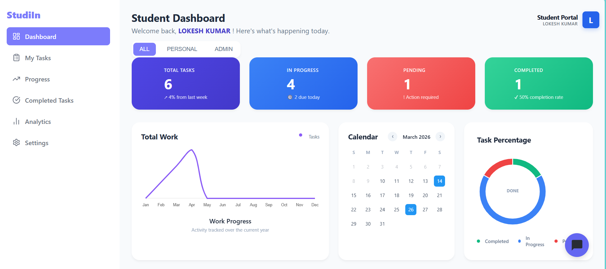
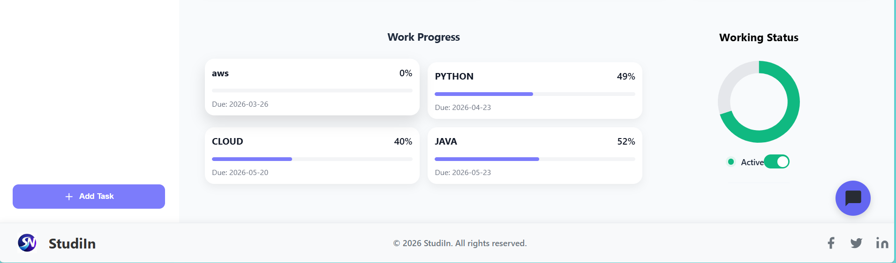

## 📋 My Tasks Page

The My Tasks page allows students to view and manage their tasks.

### Features

#### Task filtering options:

- All Tasks
- Personal Tasks
- Admin Assigned Tasks

#### Students can:

- Create personal tasks
- View admin assigned tasks
- Manage and organize their tasks

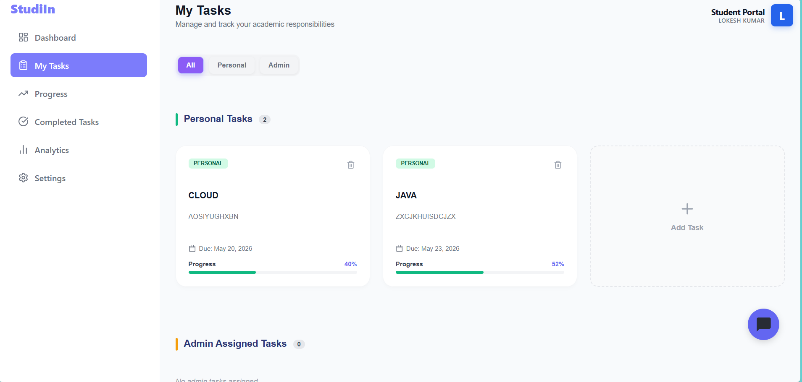

## 📈 Progress Page

The Progress Page helps students update and track task progress.

### Features

#### Task filtering options:
- All Tasks
- Personal Tasks
- Admin Assigned Tasks

#### Students can:

- Update the progress status of tasks
- Monitor task completion stages

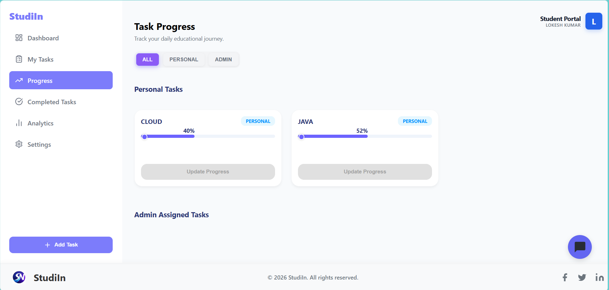


## ✅ Completed Tasks Page

The Completed Tasks page shows tasks that have been successfully finished.

### Features

Displays all completed tasks

#### Task filtering options:

- All Tasks
- Personal Tasks
- Admin Assigned Tasks

Helps students review previously completed work.

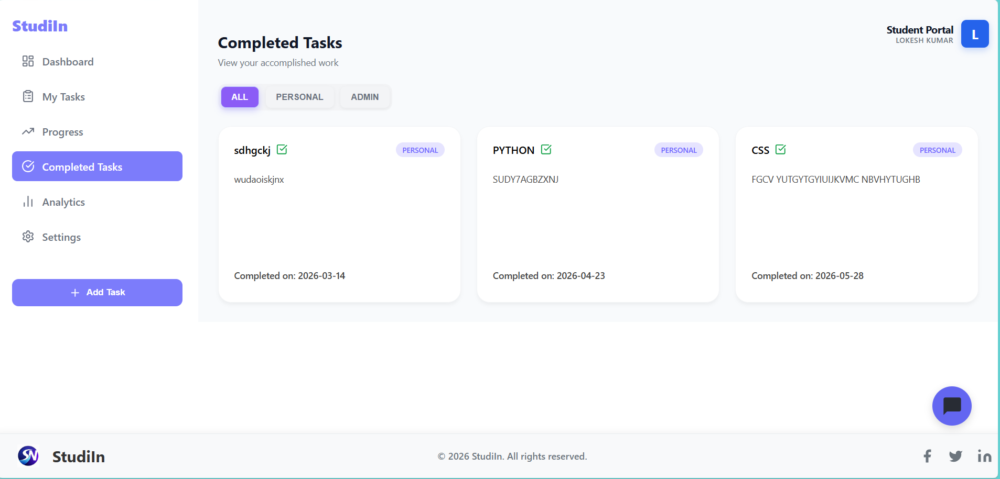


## 📊 Analytics Dashboard

The Analytics Dashboard provides insights into the student's productivity.

### Features

#### Summary Cards

- Total Tasks
- In Progress Tasks
- Pending Tasks
- Completed Tasks

Clicking on a summary card displays all tasks belonging to that category

#### Task Status Donut Chart

- Pending → Orange
- In Progress → Sky Blue
- Completed → Green

#### Task Type Chart

- Admin Tasks → Sky Blue
- Personal Tasks → Purple

#### Progress Line Chart

Displays overall task progress over time

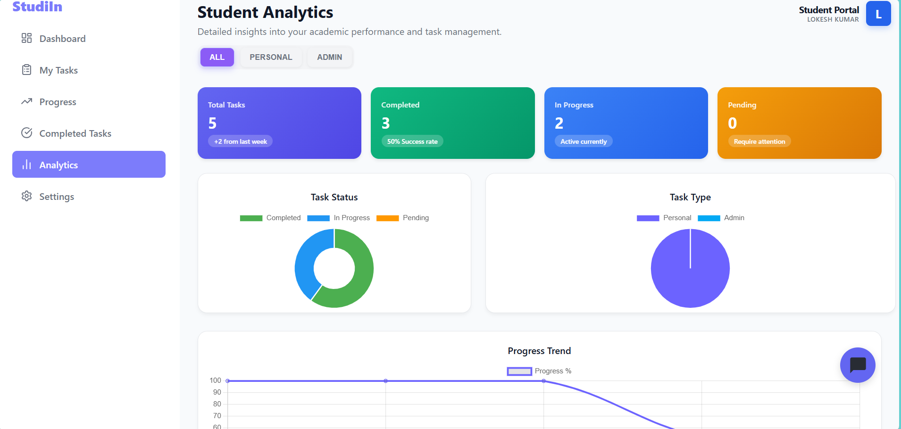
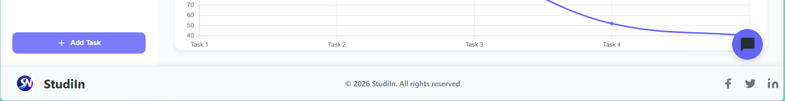

## ⚙️ Settings Page

The Settings Page allows students to manage their account.

### Features

#### Profile Settings

- Update Name
- Update Email
- Change Password
- Change password using the current password

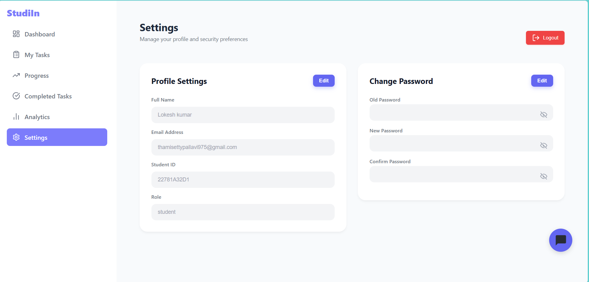

## ➕ Add Task Page

The Add Task page allows students to create new personal tasks.

### Fields

- Task Title
- Task Description
- Start Date
- End Date

Students can create tasks and manage their personal productivity.

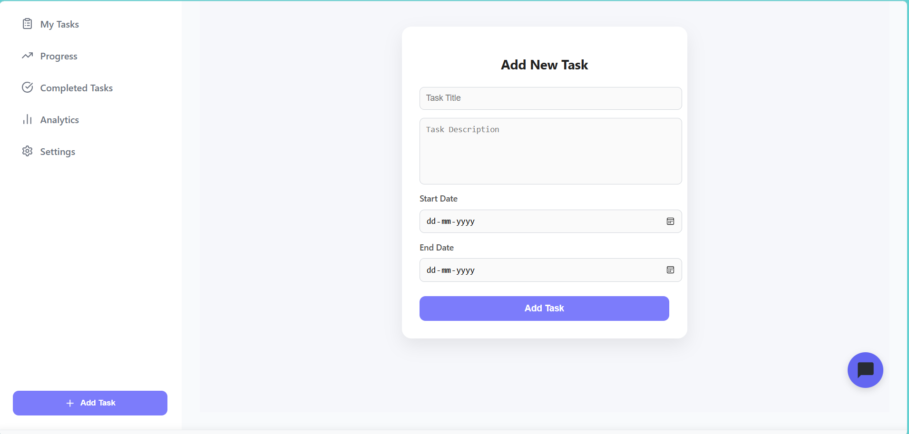


## 👨‍💼 Admin Dashboard Pages
### 🏠 Admin Dashboard

The Admin Dashboard provides an overview of student progress and overall task management within the system. It helps administrators quickly monitor productivity and track task completion statistics.

### Features

#### Summary Cards
- Total Tasks
- In Progress Tasks
- Pending Tasks
- Completed Tasks

##### Student Filter

- Allows filtering tasks by All Students

#### Total Work (Monthly) Chart

Displays a line chart representing:

- Pending tasks
- In progress tasks
- Completed tasks
- Total tasks

#### Task Percentage Chart

Donut chart visualizing overall task efficiency

#### Recent Activity

Displays the latest 4 tasks assigned in the system

#### Top Performers

Highlights students who have completed the highest number of tasks

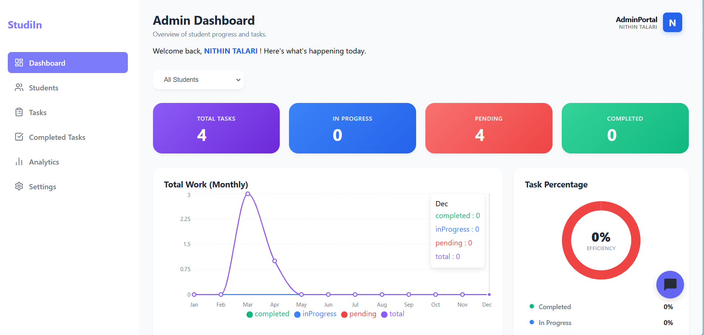
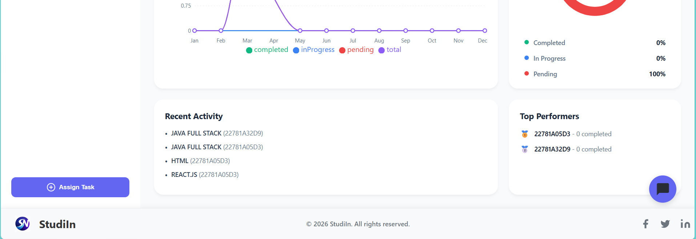

### 👥 Students Management Page

The Students Page allows administrators to manage and monitor all registered students in the system.

#### Features

- View all registered students
- Add new students
- Search students by name or student ID
- View tasks assigned to each student
- Track student activity and performance

This page helps administrators efficiently manage student accounts and monitor task progress.

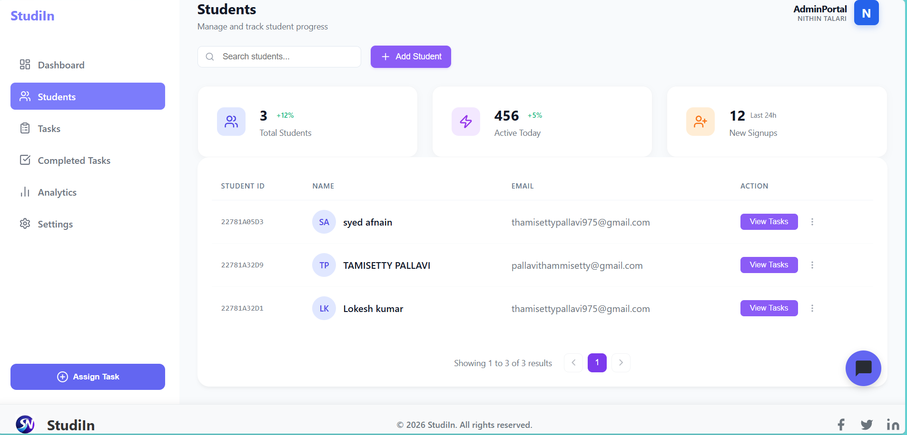

### 📋 Admin Tasks Page

The Admin Tasks Page enables administrators to manage all tasks assigned to students.

#### Features

#### Summary Cards

- Total Tasks
- Pending Tasks
- In Progress Tasks
- Completed Tasks

#### View all admin-assigned tasks

Task information includes:

- Task title
- Assigned student
- Due date
- Task progress
- Task Priority Indicators
- High Priority
- Pending tasks

This page allows administrators to track and manage all assigned tasks effectively.

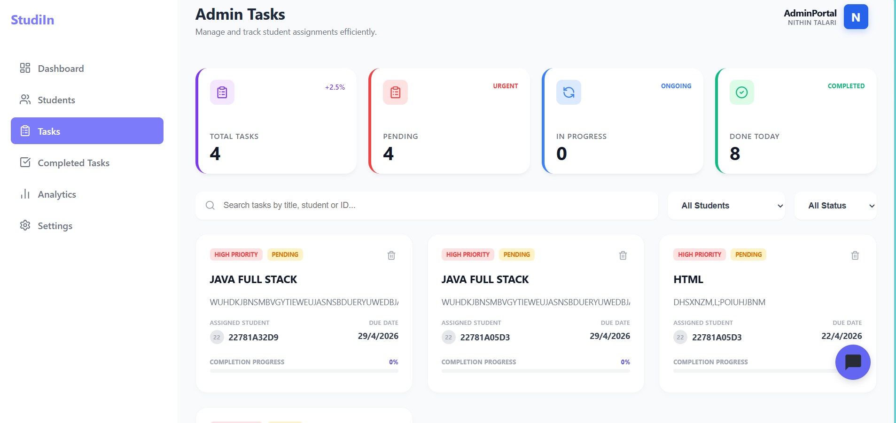

### ✅ Completed Tasks Page

The Completed Tasks Page displays tasks that have been successfully completed by students.

#### Features

- View all completed tasks
- Filter tasks by student
- Task visibility options:
- Visible tasks
- Hidden tasks

Summary cards showing completed task statistics

This page helps administrators review completed work and maintain task records.
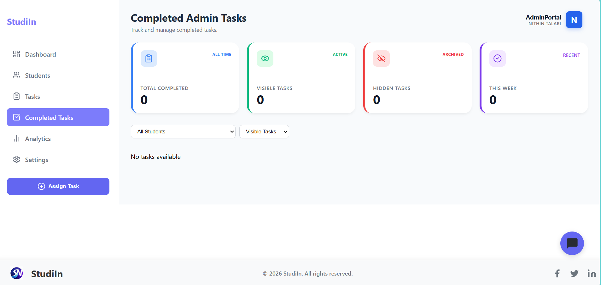

### 📊 Admin Analytics Dashboard

The Admin Analytics Dashboard provides detailed insights into student productivity and task performance.

#### Features

#### Summary Cards

- Total Tasks
- Pending Tasks
- In Progress Tasks
- Completed Tasks

Clicking any summary card displays all tasks in that category.

#### Task Completion Status

Donut chart displaying:

- Pending tasks
- In progress tasks
- Completed tasks

#### Student-wise Distribution

Graph showing task status distribution among students.

#### Student-wise Admin Task Summary

Displays for each student:

- Total tasks
- Pending tasks
- In progress tasks
- Completed tasks

This dashboard provides valuable insights to help administrators evaluate student productivity.

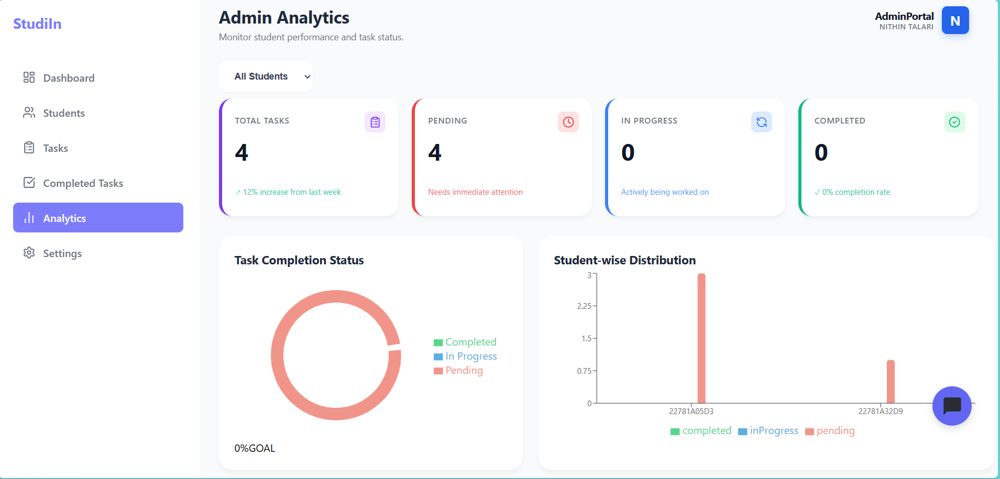
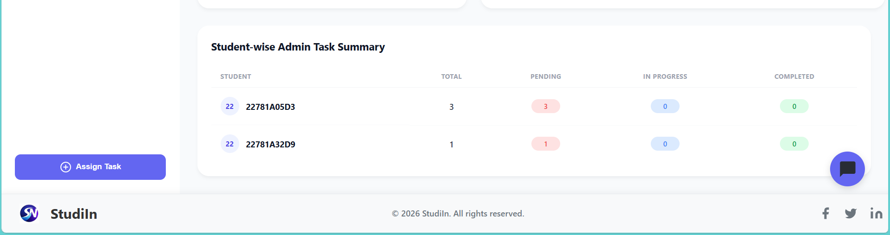

### ⚙️ Admin Settings Page

The Admin Settings Page allows administrators to manage their account information and security settings.

#### Features

#### Profile Settings

- Update admin name
- Update email address
- Change Password
- Change password using the current password
- Secure password update process

This page ensures administrators can manage their profile and maintain account security.

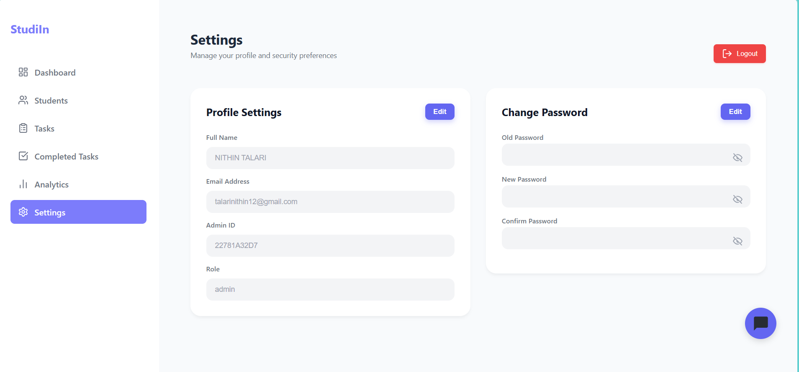

### ➕ Assign Task Page

The Assign Task Page allows administrators to assign tasks to one or multiple students.

#### Features

- Select multiple students
- Enter task title
- Enter task description
- Set task start date
- Set task end date
- Assign tasks to selected students

This feature helps administrators efficiently distribute tasks among students.

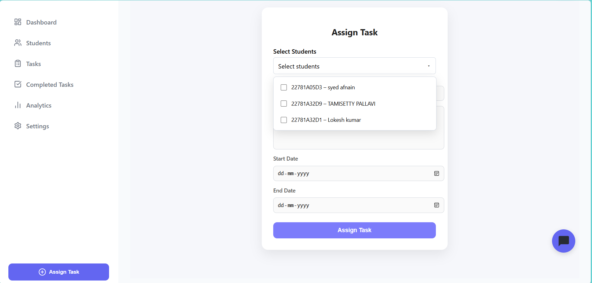


## 🤖 AI Chatbot Assistant

The AI Chatbot Assistant is integrated into the StudiIn platform to help users understand and navigate the system easily. It provides instant guidance for both students and administrators by answering questions related to platform features such as task management, progress tracking, and analytics.

The chatbot appears as a floating chat icon on the dashboard and allows users to interact with the system through a simple chat interface.

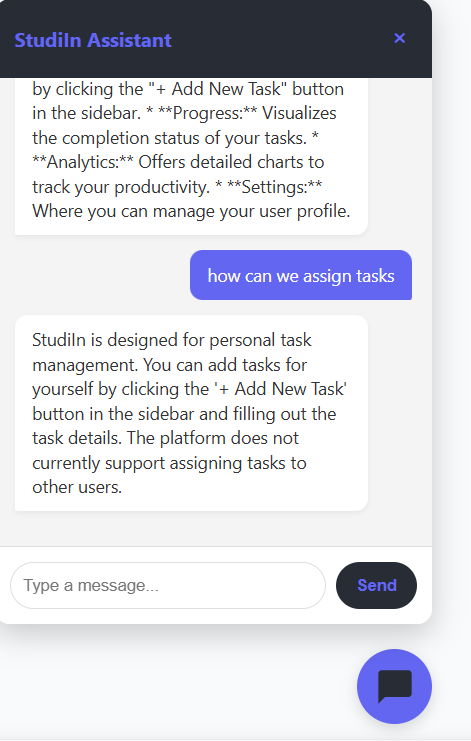

## 🛠️ Technologies Used

| Category | Technology | Description |
|----------|------------|-------------|
| Frontend | React.js | Used to build the interactive user interface |
| Frontend | HTML5 | Structure of the web application |
| Frontend | CSS3 | Styling and responsive design |
| Frontend | JavaScript (ES6+) | Client-side logic and functionality |
| Backend | Node.js | Server-side runtime environment |
| Backend | Express.js | Web framework used to build REST APIs |
| Database | MongoDB | NoSQL database used to store user and task data |
| Authentication | JWT (JSON Web Token) | Used for secure user authentication |
| Email Service | Resend API | Used for OTP email verification |
| AI Integration | Google Gemini API | Used to power the AI chatbot assistant |
| Data Visualization | Chart.js | Used to display analytics charts |
| Deployment | Render | Cloud platform used to deploy backend |
| Version Control | Git & GitHub | Used for source code management |


## 🏗️ System Architecture

The system follows a **full-stack web architecture** where the frontend communicates with the backend through REST APIs. The backend processes requests, applies business logic, and stores data in the database.

```
Frontend (React.js)
        ↓
REST API (Express.js)
        ↓
Backend Logic (Node.js)
        ↓
Database (MongoDB)
```

* **React.js** – Builds the interactive user interface and dashboards.
* **Express.js** – Handles REST API communication between frontend and backend.
* **Node.js** – Processes application logic such as authentication and task management.
* **MongoDB** – Stores users, tasks, progress data, and analytics information.


## ⚙️ Installation

Follow these steps to run the project locally.

### 1️⃣ Clone the Repository

```bash
git clone https://github.com/ThamisettyPallavi47/TASKMANAGEMENT
cd STUDENTTASKMANAGEMENT
```

### 2️⃣ Install Backend Dependencies

```bash
cd server
npm install
```

### 3️⃣ Install Frontend Dependencies

```bash
cd client
npm install
```

### 4️⃣ Setup Environment Variables

Create a `.env` file inside the **server** folder and add:

```
PORT=5000
MONGO_URI=your_mongodb_connection_string
JWT_SECRET=your_secret_key
RESEND_API_KEY=your_resend_api_key
```

### 5️⃣ Run Backend Server

```bash
cd server
npm start
```

### 6️⃣ Run Frontend

```bash
cd client
npm start
```

The application will run at:

```
http://localhost:3000
```

## 🔮 Future Scope

The Smart Student Productivity & Task Management System can be enhanced with additional features to further improve productivity and usability.

- Implement **OTP-based password reset using Nodemailer with Gmail App Password (SMTP)** for secure email verification.
- Add **AI-based task prioritization and productivity recommendations**.
- Introduce **email notifications and reminders** for upcoming task deadlines.
- Develop a **mobile application version** for Android/iOS devices.
- Enhance analytics with **advanced productivity insights and performance reports**.
- Improve the chatbot with **more intelligent and context-aware responses**.
- Add **task file attachments and document uploads**.
- Implement **role-based access control and enhanced security features**.

## 1️⃣ Project Demo / Live Link

## 🌐 Live Demo

Frontend: https://taskmanagement-9ssg.vercel.app  
Backend API: https://taskmanagement-w3gy.onrender.com

## 📄 License

This project is developed for educational and academic purposes.